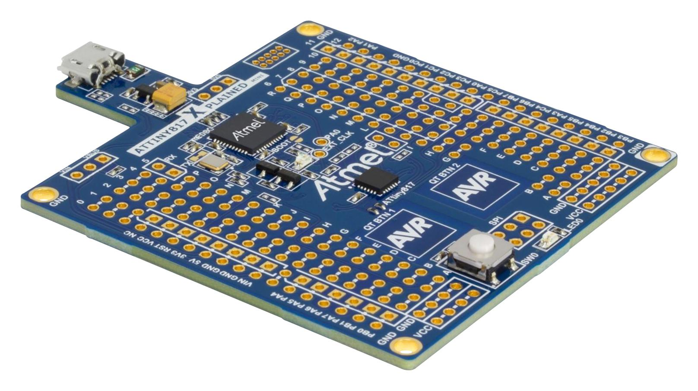
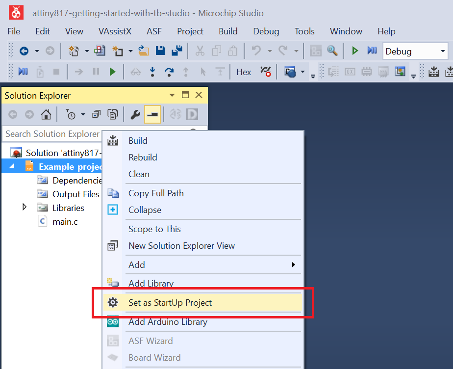
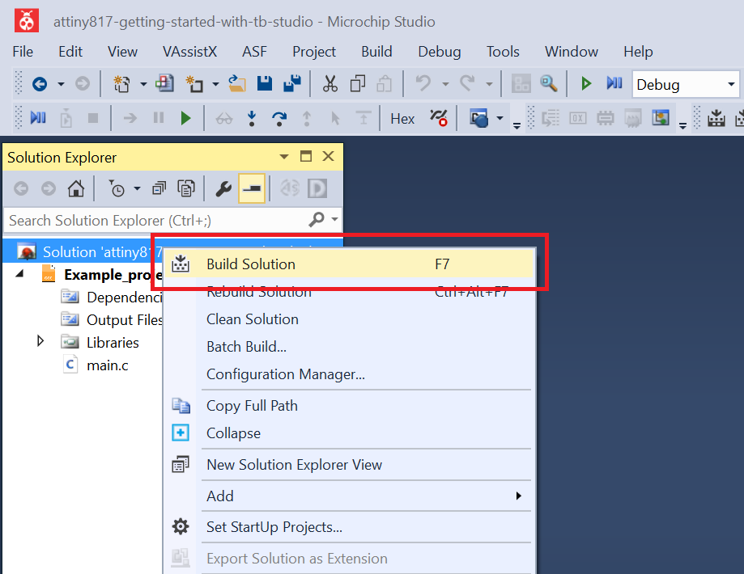
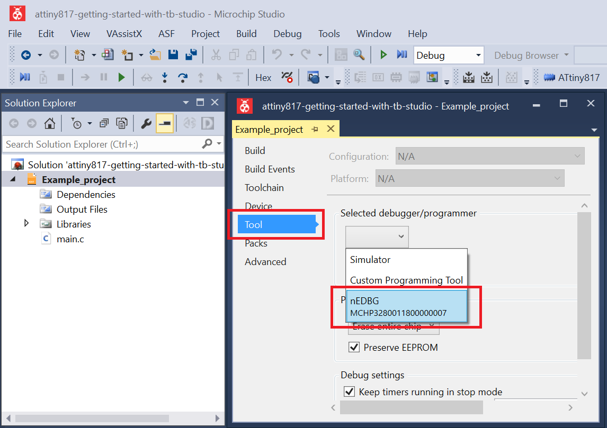
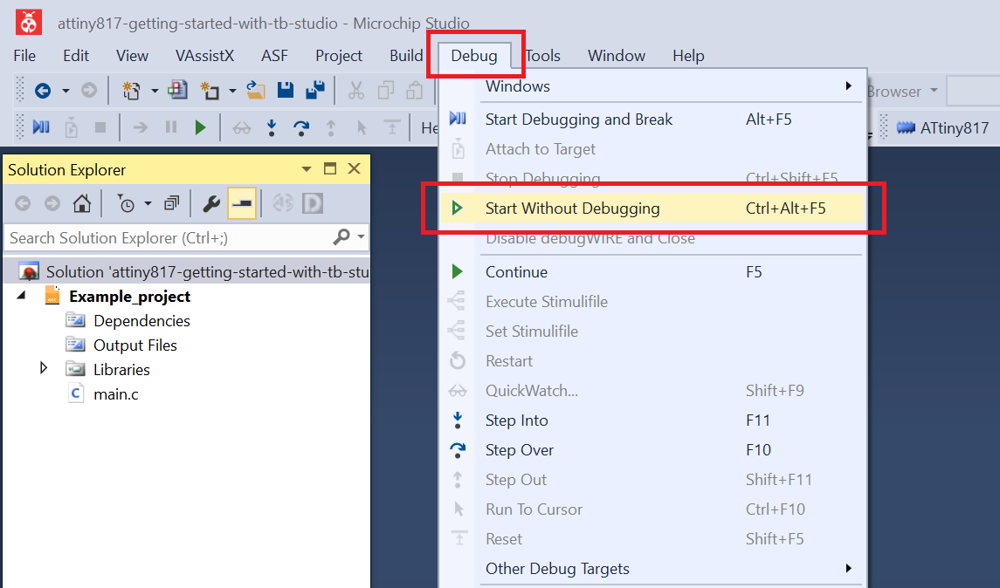
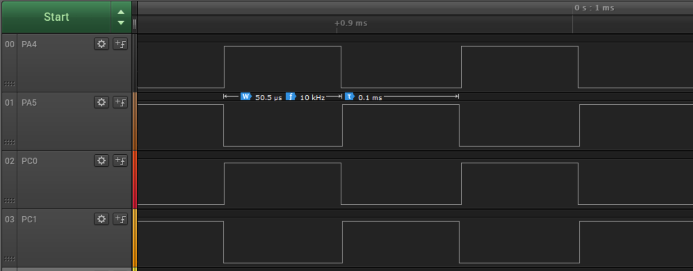
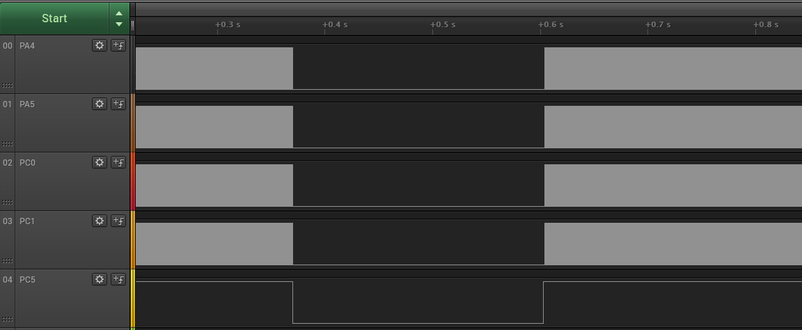

 # Controlling synchronous signals using input events

This application shows how to configure the TCD to generate four signals of 10 kHz frequency, synchronized in pairs and how to configure an input channel for fault detection. As long as the input channel value is low, the TCD stops the outputs.

## Related Documentation
More details and code examples on the ATTINY817 can be found at the following links:
- [TB3212 - Getting Started with Timer/Counter Type D (TCD)](http://ww1.microchip.com/downloads/en/Appnotes/TB3212-Getting-Started-with-TCD-90003212A.pdf)
- [ATTINY817 Product Page](https://www.microchip.com/wwwproducts/en/ATTINY817)
- [ATTINY817 Code Examples on GitHub](https://github.com/microchip-pic-avr-examples?q=attiny817)
- [ATTINY817 Project Examples in START](https://start.atmel.com/#examples/ATTINY817XplainedMini)

## Software Used
- Microchip Studio 7.0.2542 or newer [(https://www.microchip.com/mplab/microchip-studio)](https://www.microchip.com/mplab/microchip-studio)
- ATtiny_DFP 1.7.330 or newer Device Pack

## Hardware Used
- ATTINY817 Xplained Mini [(attiny817-xmini)](https://www.microchip.com/developmenttools/ProductDetails/attiny817-xmini)

## Setup
The ATTINY817 Xplained Mini Development Board is used as test platform.

 

The following configurations must be made for this project:

- System clock is configured at 3.33 MHz
- TCD
  - TCD0 clock source is High Frequency Oscillator at 20 MHz with division factor 4
  - TCD0 is configured in Four Ramp mode, with channel C matching channel A and channel D matching channel B
  - Event A configured on the edge falling low with input filter enabled and set to fault, in input mode Wait
  - CMPASET and CMPBSET registers set to 0x02, CMPACLR and CMPBCLR set to 0xF6 (the values from these registers are continuously compared to the counter value, controlling in this way the generated waveform and the dead time)
  - All output channels (A, B, C, D) are enabled.
**Note:** The register that configures the output channels is under configuration change protection.

- EVSYS
  - PC5 configured as event generator on async channel 2
  - TCD0 event 0 (user 6) configured as event user on async channel 2

- PC5 configured as digital input with internal pull-up resistor enabled

|Pin                 | Configuration      |
| :---------------:  | :----------------: |
|         PA4 	     |   Digital output   |
|         PA5	       |   Digital output   |
|         PC0 	     |   Digital output   |
|         PC1	       |   Digital output   |
|         PC5 	     |   Digital input    |

 ## Operation
 1. Connect the board to the PC.

 2. Open the attiny817-getting-started-with-tcd-studio.atsln solution in Microchip Studio.

 3. Set the Controlling_synchronous_signals_using_input_events project as StartUp project. Right click the project in the **Solution Explorer** tab and click **Set as StartUp Project**.

 

 4. Build the Controlling_synchronous_signals_using_input_events project: right click the **attiny817-getting-started-with-tcd-studio** solution and select **Build Solution**.

 

 5. Select **ATMEGA4809 Xplained Pro** in the Connected Hardware Tool section of the project settings:
   - Right click the project and click **Properties**;
   - Click the **Tool** tab.
   - Select **ATMEGA4809 Xplained Pro** (click the **SN**) in the Selected debugger/programmer section, and save (CTRL + S):

 

 6. Program the project to the board: click the **Debug** tab and click **Start Without Debugging**.

 

## Demo

The image below shows the four signals on pins PA4, PA5, PC0 and PC1. PA4 and PC0 are synchronized and PA5 and PC1 are complementary to those.
 

 The following image shows what happens while the fault is detected. The signals stop and wait for the fault to be cleared.
 

## Summary

This application showed how to configure the TCD to produce four signals of 10 kHz frequency, synchronized in pairs and how to configure an input channel for fault detection.
