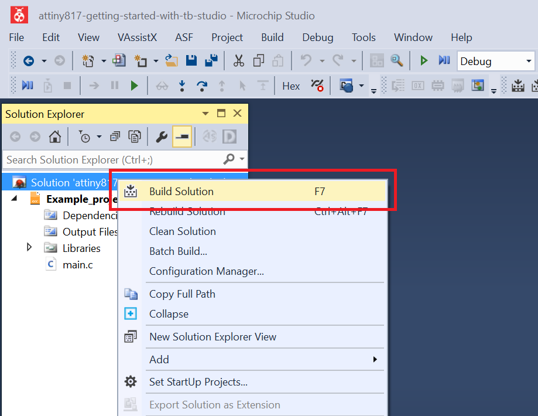
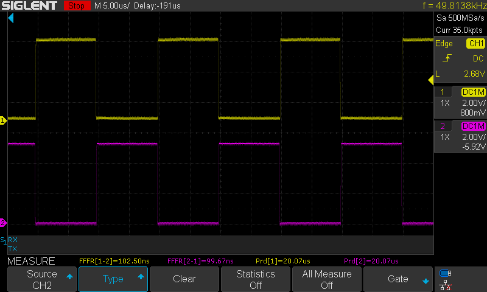

 # Generating complementary driving signals

This program shows how to configure the TCD to generate two complementary signals with 50 kHz frequency and 100 ns dead time.

## Related Documentation
More details and code examples on the ATTINY817 can be found at the following links:
- [TB3212 - Getting Started with Timer/Counter Type D (TCD)](http://ww1.microchip.com/downloads/en/Appnotes/TB3212-Getting-Started-with-TCD-90003212A.pdf)
- [ATTINY817 Product Page](https://www.microchip.com/wwwproducts/en/ATTINY817)
- [ATTINY817 Code Examples on GitHub](https://github.com/microchip-pic-avr-examples?q=attiny817)
- [ATTINY817 Project Examples in START](https://start.atmel.com/#examples/ATTINY817XplainedMini)

## Software Used
- Microchip Studio 7.0.2542 or newer [(https://www.microchip.com/mplab/microchip-studio)](https://www.microchip.com/mplab/microchip-studio)
- ATtiny_DFP 1.7.330 or newer Device Pack

## Hardware Used
- ATTINY817 Xplained Mini [(attiny817-xmini)](https://www.microchip.com/developmenttools/ProductDetails/attiny817-xmini)

## Setup
The ATTINY817 Xplained Mini Development Board is used as test platform.

 

The following configurations must be made for this project:

- System clock is configured at 3.33 MHz
- TCD
  - TCD clock source is High Frequency Oscillator at 20 MHz with division factor 1
  - The TCD is configured in Dual Slop mode with CMPBCLR equal to 0xC8, CMPASET equal to 0x63 and CMPBSET equal to 0x65 (the values from these registers are continuously compared to the counter value, controlling in this way the generated waveform and the dead time)
  - Channel A and channel B are enabled (the register that configures channel A and channel B is under configuration change protection).

|Pin                 | Configuration      |
| :---------------:  | :----------------: |
|         PA4 	     |   Digital output   |
|         PA5	       |   Digital output   |

 ## Operation
 1. Connect the board to the PC.

 2. Open the attiny817-getting-started-with-tcd-studio.atsln solution in Microchip Studio.

 3. Set the Generating_complementary_driving_signals project as StartUp project. Right click the project in the **Solution Explorer** tab and click **Set as StartUp Project**.

 

 4. Build the Generating_complementary_driving_signals project: right click the **attiny817-getting-started-with-tcd-studio** solution and select **Build Solution**.

 

 5. Select **ATMEGA4809 Xplained Pro** in the Connected Hardware Tool section of the project settings:
   - Right click the project and click **Properties**;
   - Click the **Tool** tab.
   - Select **ATMEGA4809 Xplained Pro** (click the **SN**) in the Selected debugger/programmer section, and save (CTRL + S):

 

 6. Program the project to the board: click the **Debug** tab and click **Start Without Debugging**.

 

## Demo

The image below shows the complementary signals on the PA4 and PA5 pins.
 
 The dead times are showed in the image below.
 
 

## Summary

This program showed how to configure the TCD to generate two complementary signals with a configurable dead time.
